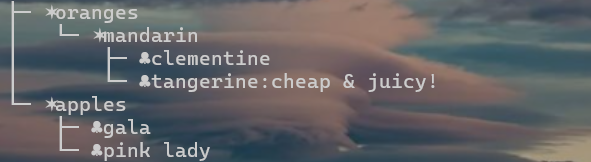
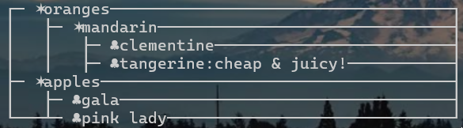

# visualJson
a simple java program that visualize json file


### Environment;

openjdk21.0.1,

Maven 3.9.5


### Usage

#### method 1:

```shell
java -jar visual.jar -f -file [filepath] -s -style [1/2] -i iconFamily
```

>-f: JSON file path to parse
>
>-s: Type of visualization, tree/rectangle
>
> -i: Icon family for visualizing JSON files, can be defined in config.conf
>
>

#### method 2:

 To run a Java source code file located in the "**visualJson**" folder.


### output:

Tree Style:



Rect Style:



